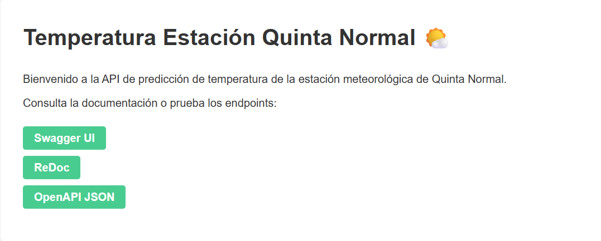

# API de Predicción de Temperatura - Estación Quinta Normal

## Contexto y Objetivo

El objetivo es diseñar, implementar y desplegar una API de predicción de temperatura para la estación meteorológica de Quinta Normal, utilizando machine learning y buenas prácticas de desarrollo de productos de datos.

## Análisis y Modelado

El análisis de datos se realizó en el notebook `Tarea_III_Análisis_de_datos_Grupo_6.ipynb` incluido en el directorio `notebooks/`, donde se exploran los datos históricos de temperatura y se desarrollan los modelos predictivos. El modelo seleccionado utiliza los valores de temperatura de las últimas 1, 2, 3, 24 y 25 horas para predecir la temperatura de la próxima hora, este fue entrenado y guardado en formato joblib (`models/model_multiple.joblib`).

## Instalación del Entorno

1. Clona el repositorio y navega al directorio del proyecto.
   ```cmd
   git clone https://github.com/desareca/DataDevPP_T2
   cd DataDevPP_T2
   ```

2. Crea y activa un entorno virtual
   ```cmd
   # Usando venv
   python -m venv venv
   # En Windows
   venv\Scripts\activate
   # En Unix o MacOS
   source venv/bin/activate
   ```

3. Instala las dependencias necesarias ejecutando:
   ```cmd
   pip install -r requirements.txt
   ```
   Si deseas trabajar con los notebooks, instala también las librerías comentadas en `requirements.txt`:
   ```cmd
   pip install matplotlib seaborn pandas requests ipykernel
   ```
3. Verifica que tienes de Python, utilizada versión 3.13.1.
   ```
   python --version
   ```

## Desarrollo de la API

La API está desarrollada con FastAPI y expone tres endpoints principales:
- `/predict`: Predicción puntual para la próxima hora.
- `/predict_n`: Predicción secuencial para n horas futuras.
- `/model_performance`: Evaluación del desempeño del modelo con métricas como RMSE, media y desviación estándar.

El archivo principal de la API es `main.py`, que carga el modelo entrenado y define los endpoints y esquemas de datos.

## Ejecución y Uso de la API

### Ejecución Local

1. Inicia el servidor FastAPI con:
   ```cmd
   uvicorn main:app --reload
   ```
2. Accede al `home` en [http://localhost:8000](http://localhost:8000) DOnde encontrarás:

- **Swagger UI** (`/docs`): Interfaz interactiva para explorar y probar los endpoints directamente desde el navegador. Permite enviar solicitudes, ver parámetros y examinar las respuestas.

- **ReDoc** (`/redoc`): Documentación detallada con un formato más limpio y orientado a la lectura. 

- **OpenAPI JSON** (`/openapi.json`): Definición completa de la API en formato OpenAPI 3.0.



3. Puedes consultar los endpoints usando herramientas como **curl**, **Postman** o **Swagger UI**.

### Ejecución en Render (Despliegue en la nube)

La API está desplegada en Render y disponible públicamente en:
- https://prediccion-temperatura-estacion-quinta.onrender.com/

Cuenta con las mismas opciones **Swagger UI**, **ReDoc** y **OpenAPI JSON**,  que la versión en local.

Puedes consultar los endpoints usando herramientas como **curl**, **Postman** o el notebook `client.ipynb` incluido en `notebooks/`.

## Estructura del Proyecto

- `main.py`: Código principal de la API.
- `models/model_multiple.joblib`: Modelo de machine learning entrenado.
- `requirements.txt`: Dependencias necesarias.
- `notebooks/`: Notebooks de análisis y pruebas (`client.ipynb` muestra ejemplos de uso de la API desplegada).
- `static/index.html`: Página de inicio para la API.

## Estructura del JSON de entrada y ejemplos de consulta

### 1. Endpoint `/predict`
**Entrada esperada:**
```json
{
  "Ts_Valor_1h": float,   // Temperatura hace 1 hora
  "Ts_Valor_2h": float,   // Temperatura hace 2 horas
  "Ts_Valor_3h": float,   // Temperatura hace 3 horas
  "Ts_Valor_24h": float,  // Temperatura hace 24 horas
  "Ts_Valor_25h": float   // Temperatura hace 25 horas
}
```
**Ejemplo válido:**
```json
{
  "Ts_Valor_1h": 13.2,
  "Ts_Valor_2h": 12.8,
  "Ts_Valor_3h": 12.5,
  "Ts_Valor_24h": 15.1,
  "Ts_Valor_25h": 14.9
}
```

### 2. Endpoint `/predict_n`
**Entrada esperada:**
```json
{
  "data": [float, float, ..., float], // Lista de 25 temperaturas (últimas 25 horas)
  "hours": int                        // Número de horas a predecir (>0)
}
```
**Ejemplo válido:**
```json
{
  "data": [13.2, 12.8, 12.5, 13.0, 13.1, 13.3, 13.4, 13.5, 13.6, 13.7, 13.8, 13.9, 14.0, 14.1, 14.2, 14.3, 14.4, 14.5, 14.6, 14.7, 14.8, 14.9, 15.0, 15.1, 15.2],
  "hours": 3
}
```

### 3. Endpoint `/model_performance`
**Entrada esperada:**
```json
{
  "data": [float, float, ..., float] // Lista de al menos 26 temperaturas (mínimo 26 valores)
}
```
**Ejemplo válido:**
```json
{
  "data": [13.2, 12.8, 12.5, 13.0, 13.1, 13.3, 13.4, 13.5, 13.6, 13.7, 13.8, 13.9, 14.0, 14.1, 14.2, 14.3, 14.4, 14.5, 14.6, 14.7, 14.8, 14.9, 15.0, 15.1, 15.2, 15.3]
}
```

**Notas sobre los valores:**
- Todos los valores deben ser numéricos (float).
- Las listas deben tener la longitud mínima requerida por cada endpoint.
- Los valores pueden corresponder a temperaturas reales históricas en grados Celsius.

## Ejemplo de Uso desde Notebook

En el notebook `notebooks/client.ipynb` se incluyen ejemplos para consultar los endpoints principales usando la librería `requests`. Esto permite validar el funcionamiento de la API tanto en local como en la versión desplegada en Render.
