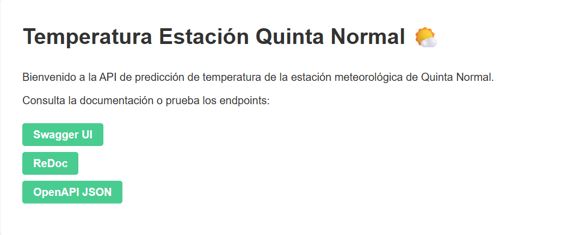
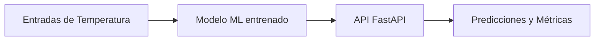

# API de Predicción de Temperatura - Estación Quinta Normal

## 📌 Contexto y Objetivo
El objetivo de este proyecto es diseñar, implementar y desplegar una **API de predicción de temperatura** para la estación meteorológica de **Quinta Normal**, utilizando machine learning y buenas prácticas de desarrollo de productos de datos.  

El análisis exploratorio y la construcción de modelos se documentan en el notebook [`notebooks/Tarea_III_Análisis_de_datos_Grupo_6.ipynb`](notebooks/Tarea_III_Análisis_de_datos_Grupo_6.ipynb), donde se describe:  
- **Dataset:** mediciones horarias históricas de temperatura.  
- **Periodo y fuente:** detallados en el notebook.  
- **Modelos probados:** se evaluaron distintos enfoques y se seleccionó el que mejor balancea rendimiento y simplicidad.  
- **Métricas obtenidas:** RMSE, MAE y R² (consultar notebook para valores exactos).  

El modelo final utiliza los valores de temperatura de las últimas **1, 2, 3, 24 y 25 horas** como variables predictoras, entrenado y guardado en `models/model_multiple.joblib`.

---

## ⚙️ Instalación del Entorno

1. Clona el repositorio y navega al directorio del proyecto.
   ```cmd
   git clone https://github.com/desareca/DataDevPP_T2
   cd DataDevPP_T2
   ```

2. Crea y activa un entorno virtual
   ```cmd
   # Usando venv
   python -m venv venv
   # En Windows
   venv\Scripts\activate
   # En Unix o MacOS
   source venv/bin/activate
   ```

3. Instala las dependencias necesarias ejecutando:
   ```cmd
   pip install -r requirements.txt
   ```
   Si deseas trabajar con los notebooks, instala también las librerías comentadas en `requirements.txt`:
   ```cmd
   pip install matplotlib seaborn pandas requests ipykernel
   ```
3. Verifica que versión tienes de Python, versión utilizada 3.13.1.
   ```
   python --version
   ```

---

## 🛠️ Desarrollo de la API

La API está desarrollada con FastAPI y expone tres endpoints principales:
- `/predict`: Predicción puntual para la próxima hora. Considera como entrada valores de temperatura especificas de ***Ts_Valor_1h***, ***Ts_Valor_2h***, ***Ts_Valor_3h***, ***Ts_Valor_24h*** y ***Ts_Valor_25h*** horas antes de la predicción, devolviendo la predicción `predicted_temperature` para la hora siguiente.
- `/predict_n`: Predicción secuencial para n horas futuras. Considera como entrada una lista de 25 temperaturas ***[Ts_Valor_25h ... Ts_Valor_1h]*** y el número de horas a predecir ***nhours***, devolviendo una lista de predicciones de temperaturas `predicted_temperature` ***[Pred_temp_h<sub>0</sub> ... Pred_temp_h<sub>nhours-1</sub>]***.
- `/model_performance`: Evaluación del desempeño del modelo con métricas como RMSE, media y desviación estándar. Considera como entrada una lista de 26 (o más) temperaturas ***[Ts_Valor_25h ... Ts_Valor_1h, Ts_Valor_0h ... Ts_Valor_nh]***, devolviendo:
  - `real_temperature`: Lista de Temperaturas reales ***[Ts_Valor_0h ... Ts_Valor_nh]***
  - `predicted_temperature`: Lista de Temperaturas predichas ***[Pred_temp_0h ... Pred_temp_0h]***
  - `rmse`: Raiz error cuadrático medio. 
  - `mean_true`: Promedio de temperaturas reales. 
  - `mean_pred`: Promedio de predicciones de temperaturas. 
  - `std_true`: Desviación de temperaturas reales. 
  - `std_pred`: Desviación de predicciones de temperaturas. 

El archivo principal de la API es `main.py`, que carga el modelo entrenado y define los endpoints y esquemas de datos.

### Manejo de Errores

La API incluye manejadores personalizados que devuelven los mensajes de error en **español** y en formato JSON estructurado:

- **Errores de validación de entrada** (422)  
  Devuelven un objeto con la lista de campos y mensajes traducidos.
- **Errores HTTP genéricos** (404, 405, 400, 401, 403, 429, 503)  
  Cada código tiene un mensaje claro en español.
- **Errores internos** (500)  
  Respuesta genérica: `"Error interno del servidor."`.

Ejemplo de error 422:
```json
{
  "detalle": "Error de validación de entrada.",
  "errores": [
    { "campo": "body.Ts_Valor_1h", "mensaje": "La entrada debe ser una lista válida." }
  ]
}
```

### Validaciones y Configuración Interna

El archivo `main.py` define validaciones estrictas sobre los datos de entrada:

- **Rangos de temperatura permitidos:** de `-20.0°C` a `60.0°C`.  
- **Longitud de datos obligatoria:**
  - `/predict_n`: exactamente 25 valores de temperatura.
  - `/model_performance`: mínimo 26 valores.
- **Valores no permitidos:** `null`, `NaN`, `Infinity` o fuera de rango.
- **Predicción máxima:** hasta 12 horas.
- **Evaluación de rendimiento:** hasta 30 días de datos (720 valores).

La API también:
- Verifica si el modelo está disponible antes de predecir (código de error 503 si no lo está).
- Registra eventos y errores en consola mediante `logging`.

---

## 📡 Ejecución y Uso de la API

### Ejecución Local

1. Inicia el servidor FastAPI con:
   ```cmd
   uvicorn main:app --reload
   ```
2. Accede al `home` en [http://localhost:8000](http://localhost:8000) donde encontrarás:

- **Swagger UI** (`/docs`): Interfaz interactiva para explorar y probar los endpoints directamente desde el navegador. Permite enviar solicitudes, ver parámetros y examinar las respuestas.

- **ReDoc** (`/redoc`): Documentación detallada con un formato más limpio y orientado a la lectura. 

- **OpenAPI JSON** (`/openapi.json`): Definición completa de la API en formato OpenAPI 3.0.



3. Puedes consultar los endpoints usando herramientas como **curl**, **Postman** o **Swagger UI**.

### Ejecución en Render (Despliegue en la nube)

La API está desplegada en Render y disponible públicamente en:
- 👉 https://prediccion-temperatura-estacion-quinta.onrender.com/

Cuenta con las mismas opciones **Swagger UI**, **ReDoc** y **OpenAPI JSON**,  que la versión en local.

Puedes consultar los endpoints usando herramientas como **curl**, **Postman** o el notebook `client.ipynb` incluido en `notebooks/`.

---

## Estructura del JSON de entrada y ejemplos de consulta

### 1. Endpoint `/predict`
**Entrada esperada:**
```json
{
  "Ts_Valor_1h": float,   // Temperatura hace 1 hora
  "Ts_Valor_2h": float,   // Temperatura hace 2 horas
  "Ts_Valor_3h": float,   // Temperatura hace 3 horas
  "Ts_Valor_24h": float,  // Temperatura hace 24 horas
  "Ts_Valor_25h": float   // Temperatura hace 25 horas
}
```
**Ejemplo válido:**
```json
{
  "Ts_Valor_1h": 13.2,
  "Ts_Valor_2h": 12.8,
  "Ts_Valor_3h": 12.5,
  "Ts_Valor_24h": 15.1,
  "Ts_Valor_25h": 14.9
}
```

### 2. Endpoint `/predict_n`
**Entrada esperada:**
```json
{
  "data": [float, float, ..., float], // Lista de 25 temperaturas (últimas 25 horas)
  "hours": int                        // Número de horas a predecir (0 < hours <= 12)
}
```
**Ejemplo válido:**
```json
{
  "data": [13.2, 12.8, 12.5, 13.0, 13.1, 13.3, 13.4, 13.5, 13.6, 13.7, 13.8, 13.9, 14.0, 14.1, 14.2, 14.3, 14.4, 14.5, 14.6, 14.7, 14.8, 14.9, 15.0, 15.1, 15.2],
  "hours": 3
}
```

### 3. Endpoint `/model_performance`
**Entrada esperada:**
```json
{
  "data": [float, float, ..., float] // Lista de al menos 26 temperaturas (mínimo 26 valores)
}
```
**Ejemplo válido:**
```json
{
  "data": [13.2, 12.8, 12.5, 13.0, 13.1, 13.3, 13.4, 13.5, 13.6, 13.7, 13.8, 13.9, 14.0, 14.1, 14.2, 14.3, 14.4, 14.5, 14.6, 14.7, 14.8, 14.9, 15.0, 15.1, 15.2, 15.3]
}
```

**Notas sobre los valores:**
- Todos los valores de temperatura deben ser numéricos (float).
- Las listas deben tener la longitud mínima requerida por cada endpoint.
- Los valores pueden corresponder a temperaturas reales históricas en grados Celsius.

### Ejemplo de Uso desde Notebook

En el notebook `notebooks/client.ipynb` se incluyen ejemplos para consultar los endpoints principales usando la librería `requests`. Esto permite validar el funcionamiento de la API desplegada en Render.

---

## 🔄 Flujo Visual del Sistema


```mermaid
flowchart LR
    A[Entradas de Temperatura] --> B[Modelo ML entrenado]
    B --> C[API FastAPI]
    C --> D[Predicciones y Métricas]
```
---

## 📂 Estructura del Proyecto

```
DataDevPP_T2/
│── main.py                  # Código principal de la API
│── requirements.txt         # Dependencias
│── render.yaml
│── LICENSE
│── .gitattributes
│── .gitignore
│── models/
│   └── model_multiple.joblib
│── notebooks/
│   ├── Tarea_III_Análisis_de_datos_Grupo_6.ipynb
│   └── client.ipynb         # Ejemplos de uso de la API desplegada
│── static/
│   └── index.html           # Página de inicio
│   └── Home_API.png
```